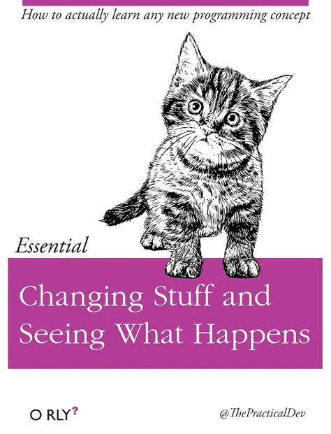

```{r, echo=FALSE, message=FALSE, warning=FALSE}
wk1.date <- as.Date("2019-08-26")
```

This is the course website for <span style="color:teal">**Applied Statistical Methods 1**</span> course taught by [Dr. Robin Donatello](www.norcalbiostat.com) in Fall 2019. This landing page is used for posting of regular announcements and information for students of the class. 

<br>

<!---
### 5/12/19 - Finals Week

* Common Final (Both classes): *Tehama 116 4-6pm*
* Poster peer review Google Form: https://forms.gle/169KD9x43T5YKHGh6 
    - Some paper copies will be available. 
    - You will be expected to review 10 posters during the final session. 
* Office Hours: MW 9:30-11:30, T 9:11am

Final assignments (Due Friday 5/17)

* MAI Post assessment - Google Form
* Post-course survey from Lisa Dierker (will be emailed to you this week)
* Post assessment in R - Google Form
* Any remaining extra credit

Good luck with all of your finals, and congratulations to those who are graduating on Saturday!


---

### 5/6/19 - Week 15

* Poster building week! **Due dates are FIRM**
    - Instructions are on [the project page.]( https://norcalbiostat.github.io/MATH315/project.html#posters_presentations)
    - Guidelines and templates are here: https://norcalbiostat.netlify.com/lec/poster_guidelines/ 
    - Drafts are due Wednesday 5/8 at 5pm
    - Peer review Friday 5/10 EOD
    - Final version due Monday 5/13 at 2pm
* Take Home Final exam 
    - Distributed Wed 5/8 (Estimated) via Slack. 
    - Due Wednesday 5/15 EOD. 
        - [Upload your **RMD code** file to this link.](https://www.dropbox.com/request/HNPJtln9HcqxVgM7omDD)
        
#### Expanded Office Hours - 11 hours!!!
* Monday: 10-11am, 3-4pm 
* Tuesday: 10-12pm, 2-4pm (Tehama 116)
* Thursday: 10-11am, 2-4pm (Tehama 116)
* Friday: 11-12pm, 2-3pm
   
<!--- 
### 12/3/18 - [Week 14](https://norcalbiostat.github.io/MATH315/wk/wk14.html)
* You should be working on finishing the regression assignment, and Poster Prep Stage III this week. 
* You will be building models, and having to decide which model fits the data best using different criteria. 
    - Textbook references: Open Intro 8.2, Applied Statistics Notebook Section 7.7


### 4/15/19 - [Week 12](https://norcalbiostat.github.io/MATH315/wk/wk12.html)

SET's this week. Please be present. 

We're starting to talk about multivariable models this week. This involves
understanding how to think about simultaneous relationships between multiple variables. 

Life isn't bivariate. We "know" there is more to how big a caterpillar is than simply the species. What about the temperature? was it a drought year? what type of tree is it on? How heavy is the bird predation in that area? What other species are on the same tree that could be competing for resources? To understand the singular effect of bird predation on caterpillar size, we must consider how all other factors affect caterpillar size, and how those other factors might be related to each other as well. 

The course notes is a "cliff notes" version of the lecture material for this coures. If you're not watching the videos (even on 1.5x speed) you are missing critical information that I will not lecture on in class, but that you will be responsible for on the homework and exam. 

**Due this week**

* HW09 - Moderation
* Poster prep stage II - this includes a full revision of all stage 1 slides, and adding slides for two bivariate analyses. 


### 4/8/19 - [Week 11](https://norcalbiostat.github.io/MATH315/wk/wk11.html)

DataFest is over and so I'm back 100% with you!

We're finishing up Bivariate Inference this week. 

* Correlation & Regression - similar, but different purposes. 
* HW 8 due this Saturday
* Think about which inferential tools you are going to want to use on your personal research questions. 

Self and peer evaluation form available: Due Sunday https://forms.gle/Vrhf9FEqwiWYPD4N9

### 4/1/19 - [Week 10](https://norcalbiostat.github.io/MATH315/wk/wk10.html)

This week got lost in the post-sickness & pre-DataFest ether. 


### 3/25/19 - [Week 9](https://norcalbiostat.github.io/MATH315/wk/wk09.html)

The rest of the semester is all about Inference! This is what you've been training for, and waiting for. This week we'll start out with setting the foundations of the process on 1 variable, then quickly move into testing relationships between two variables. 

#### Due this week
* Hypothesis testing quiz on Tue/Wed
* HW 8 BIG assignment! Has multiple parts. Procrastinate and be doomed. 

#### Midterm Error Assessment (Optional - Due 4/5/19)
As an opportunity to look for patterns in your test taking and to develop strategies to perform better in the future, there is an optional error assessment that you can complete. If you do so you can earn up to half the points missed on the exam back. To do this you must use the [Analyzing exam errors form](reading/Analyzing exam errors.pdf) available on the materials page. Using this form you will: 

* Classify the types of errors you made (where you lost points). 
    - Identify common patterns or themes.
* On a separate paper, correctly re-work every problem you missed. 
* Go over your corrections with a tutor (or me). 
    - Explain what you did wrong and why your corrections are right.
    - Discuss strategies to perform better on future exams. 


---


### 3/11/19 - [Week 8](https://norcalbiostat.github.io/MATH315/wk/wk08.html)

Office Hours for this week:

  - Mon 10-11 Holt 202
  - Tue 11-12 Holt 202, Community Coding 2-4pm Tehama 116
  - Wed 10-12 Holt 202
  - Thu Community Coding 2-4pm Tehama 116
  - Fri 12-1 Holt 202

#### Due this week
* Poster Prep Stage I: Setting the Stage & Exploratory Data Analysis. 
    - Draft due Tuesday, Peer Review by Thursday, Final by Saturday
* Foundations worksheet. Practice setting up inference on your research question
    - Done in class, docx available on Materials page.
    - Come prepared! Choose 1 binary and 1 quantitative variable from your data set. 
        - Create a frquency table for the binary catgorical
        - Calculate the mean, sd, and number of valid records for the quantitative. 
    - Due with Midterm
* Midterm Thursday/Friday
    - Sample exam posted on the Materials page. Shows you the structure of the exam. 
    - A calculator is not needed, but you may want one. 
    - Only your course packet is allowed on the exam. 

----

### 3/4/19 - [Week 7](https://norcalbiostat.github.io/MATH315/wk/wk07.html)

Monday I will be at the WiDS conference (across the creek) and so Kathy Gray will cover class for me.
You will be covering material in the course packet 4.1-4.4, foundations for inference. Also be sure to watch the PDS video, the relevant content starts at 14 minutes and goes until about 16 minutes.  


#### Due this week 

* Worksheets on discovering the Central Limit Theorem
    - Both worksheets (parameters vs statistics and the CLT) can be found on the materials page under homework
    - Worked on in class on Monday/Tuesday, turned in Wednesday/Thursday 
    - Quiz on interval estimates due Wednesday (for TR) or Thursday (for MWF)
        - Review Course packet section 4.5 for this material
* Draft of your research proposal is due on Tuesday, peer review Thursday, final version due Saturday. 
    - Read the peer review instructions in Homework 7 carefully. (they were updated Tuesday AM)

#### Events for this week (always free and open to all unless specified)

* Monday 3/4: Women in Data Science technical conference. Live stream of the global conference out of Stanford, lunchtime career panel featuring local women in Data Science, and an opportunity to present your research in our "local women sympoisum" https://wids-chico.netlify.com/event/ 
* Tuesday 3/5: DSI seminar on strategies to manage big data. 2-3pm, Tehama 116. 


----


### `r format(wk1.date+4*7, "%m-%d-%Y")` Week 5: Describing Relationships

Now that you've had a chance to learn what your data looks like, exploring relationships and learning more about the variables that you are interested in researching, let's take a step back and look at the big picture. You will use lecture notes on writing empirical research (found on the materials page of this website) to guide the writing of a research proposal. 

Applied statistics is used to support research. Numbers and measures don't stand on their own. It is important that you understand how to use data to support scienctific research. 

So far you have been conducting an exploratory data analysis to learn the distributions of your measures, and to assess for any possible relationships in your research. You cannot make any statistical claims about whether or not a relationship is significant at this point. That is under the realm of _inferential statistics_ and will be the topic of the class after Spring break. 

To understand why inferential statistics can be used to make valid claims, we have to learn a little bit about _Probability_ first. This topic is only briefly covered in the PDS videos. You will have to spend more time in the course packet, AND in the OpenIntro textbook if you have never taken a statistics course before. 

This is a much more mathematical section of the course, so be sure to plan your time accordingly. Over the next two weeks you should be writing your research proposal, working on your poster preparation slides, and filling out the notes and examples in the course packet. We will be working heavily out of the course packet, so it is essential that you read the material ahead of time so the examples we work through in class are meaningful. 

----
--->

### `r format(wk1.date+5*7, "%m-%d-%Y")` Week 6: Reflection, Midterm, and new stuff. 

We're going to switch gears here and talk about probability, but before we do that let's take a step back and think about what we've learned so far and consider how our thoughts about Statistics has changed due to this new information. It's also a time for self reflection. How are you doing in this class? Are you happy with your grade? What can you do differently? 

This week is mostly about prepping for the exam. We will do a probabilty activity on wednesday to get us ready for the next unit.

**Quick week overview**: 

* Reflect, catchup, recap Monday
* Poster prep stage II (Draft due Tue)
* Probabilty Wednesday
    - Only watch the first part of PDS Video 8
    - But read the course packet carefully
* <span style="color:red">Midterm Friday</span>. 
    - Sample exam available
    - Review session Tuesday night 8-9pm over Zoom (online video conferening program). Use [[this link]](https://csuchico.zoom.us/j/5808362949) to join the conference call You will need a headset or earbuds. The session will be recorded and all info will be posted in the <span style="color:blue">#midterm-review</span> Slack channel 
* Self and peer reflection due Saturday. 

**Updates** I have cxl'd HW 6 (research proposal). Quiz 6 is still required but will stay open until Monday night. 


### `r format(wk1.date+4*7, "%m-%d-%Y")` Week 5: Describing Relationships


> It's ok to struggle, it's not OK to not do anything. If you are having trouble with coding, you need to ask for help. 
This class builds on each assignment. You can't do HW05 well if you didn't do HW04. You won't be able to do HW06 if you can't do HW05. 
Don't risk falling behind, you will struggle to catch up and may not pass. There are five of us available to help you during office hours and Community Coding. You can make appointments with any of us outside of our scheduled hours as well. 

* This week we will discuss how to create visualizations to assess the relationship between two variables. 
* The homework assignments are training grounds for you to practice how to create and interpret graphics to explore your research question. The graphs you make for the homework may or may not be directly related to your research question. 
* You may have to go back to your raw data and pull in new measures. Or adjust your variables (like collapsing levels) based on what you observed in last week's assignment. 

* Monday 2pm OH cancelled this week. Extra OH Monday at 9, and Wed at 9am. 

----


### `r format(wk1.date+3*7, "%m-%d-%Y")` Week 4: Describing Distributions of Data

I'm alive!

> OH Cancelled Monday. Sorry, lot of Drs appts in the upcoming weeks that were scheduled months ago. 
> Additional OH Wednesday at 9am

If there's one take home message for this week, is to describe the distribution of variables you need: 

1. a picture
2. summary statistics
3. a complete sentence interpretation

While your goal should be to make figures stand alone, you won't be there quite yet. Your coding skills will
develop as you go on throughout the semester. 

* You will also start the work to build your research poster. See the [project instructions](project.html) page for details. This means you have *two* assignments due this Friday. Procrastinate at your own peril. 

> Re: Homework 03. I will adjusted the grading rubric to downweight the data management portion. 
> This is a wakeup call for all of you who tried to start the HW on Saturday evening. You won't be able
> to do HW for this class in an evening. There is a reason we work on it all week in class. I advise going and
> reading the [[advice from last year's students]](reading/Advice from prior Math 315 students.pdf). 

<span style="color:red">**HW03 is a critical assignment**</span> You can't complete any remaining homework until you get this file working. If you were unsuccessful this week, your goal is to work with your resources (each other, tutors, peer mentors, office hours, community coding) until you get it working. 

----


### `r format(wk1.date+2*7, "%m-%d-%Y")` Week 3: Hello R! - Preparing Data for Analysis. 

> I may be late to my OH on Tuesday. I have to take my dog `r emo::ji('dog')` to the vet :( 


* We are starting to code in R this week. You should follow along with the coding that is done in the PDS video. Practicing typing commands and mimicking the output that is in the video is very important and will contribute to your learning. 

* In class on Monday you will work with your partner to take a closer look at your codebook to identify what types of data management you will have to do. 

* I have created a [[video]](https://youtu.be/fv2NLL3dYYQ) to walk you through how to get your data into R Studio. 

* The [[Help with R]](help_R.html) page has more info such as useful functions and how to navigate data. 

#### Entering a challenging time

You may feel like this in the next couple weeks: 

<center></center>
<br>

But if you use the references in the course notes, the peer mentors, videos and engage in the most effective way of learning a new programming language, 

<center></center>
<br>

then you will learn how to dominate debugging and come out a stronger and more capable of being able to answer research questions using data. 

<center></center>

<br>

----


### `r format(wk1.date+7, "%m-%d-%Y")` Week 2: Generating research questions

Hope everyone had a relaxing 3day weekend. Office hours have been set. Thank you for contributing! 

* Monday 2-3pm Holt 202
* Tuesday 10-11am Holt  202
* Wednesday 2-4pm PHSC 213 (Community Coding)
* Thursday 2-4pm MLIB 442 (Community Coding)

Due to a glitch in the system, Quiz 1 is going to be considered a "trial run" and not count towards your grade. 

This week we're going to cover the basic data types, how to formulate a testable research hypotheses on your selected data, and setting up a reproducible research pipeline to prepare data for analysis. 

Haven't selected a [[research data set]](https://drive.google.com/open?id=1jULudBjRbHdW-uLIvmMbxRBEJJkq9crY) yet? 
Look at the [[sign up sheet]](https://docs.google.com/spreadsheets/d/1kyRCJMYQ4fa3RveUOH1EgwZyzOvRLzNy0uQajEEtarg/edit?usp=sharing) to see what's left and sign up to analyze a data set. If you don't have a partner yet, put your name down by a data set you are interested in analyzing, or post in the #assignments channel in slack that you're looking for a partner. 

<span style="color:red">**Quiz 2 due Tuesday**</span> Don't forget this week we start having Quizzes on the upcoming week material. You must watch the videos and look through the course notes to be prepared for these quizzes!


----

### `r format(wk1.date, "%m-%d-%Y")` Week 1: Welcome to Fall 19!

* This course website contains all materials except the textbook for this class. Be sure to familiarize yourself with the organization. You will be here a lot. Bookmark this page.
* I have created a handy [[Materials Overview]](reading/Materials overview.pdf) that walks you through the components of this class. 
    - I even [[recorded a video]](https://youtu.be/ln3HSIMbhXk) going over it for ya'all! 
* Take this survey to help choose when I should hold Office Hours: https://forms.gle/6ZTSfrJ2WbyKMfk39 


