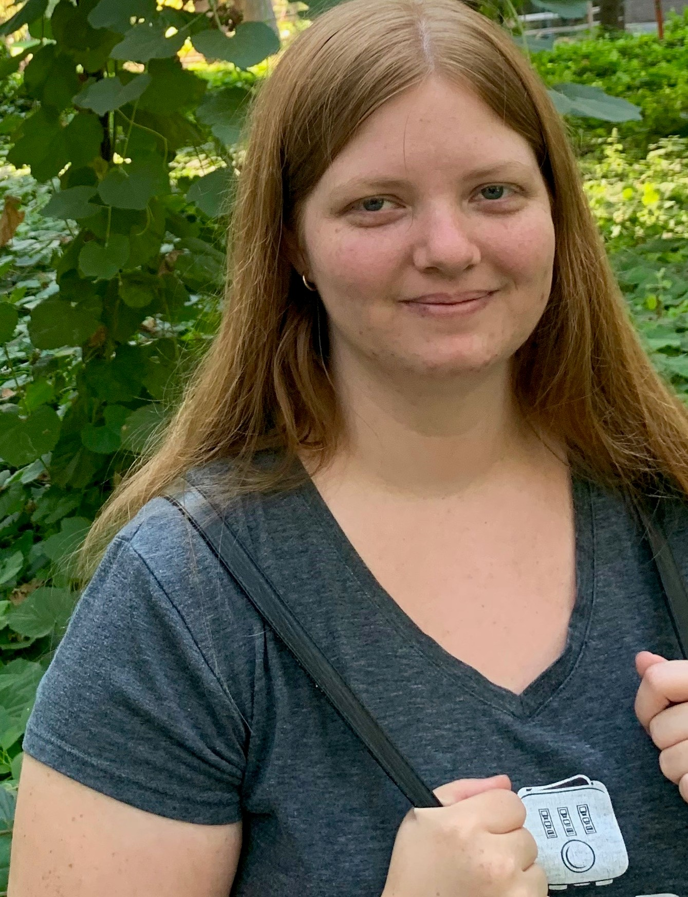
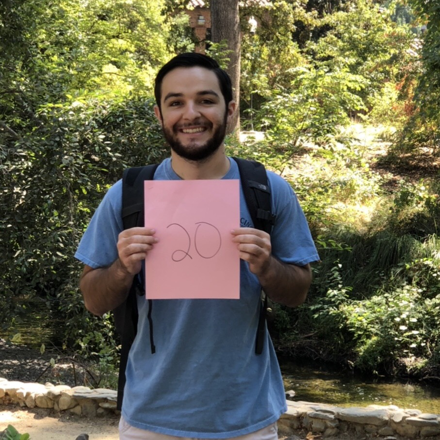

 

# Peer Mentors for Spring 19

Unless specified otherwise, scheduled office hours for Peer Mentors are held in the Math tutoring lab, 4th floor of Miriam Library. They also are part of our Slack workspace. 

You can request help outside their regular office hours _at their discretion_ by asking in the #tutor-request channel in Slack. 
 

----

### Aspen Fairley
<table>
<tr>
  <td width="250"></td>
  <td width="50"></td>
  <td width="250"><strong>Known for:</strong> Being a human Google   
    <strong>Attending: </strong> MW 10-11am   
    <strong>OH: </strong> By appointment (post in #tutor-request Slack channel)   
    <strong>Contact: </strong> afairley@mail.csuchico.edu   </td>
  <td width="50"></td>
  <td width="350">I am a bio major on the EEO course that just transferred in last fall. Grew up in small-town Bishop, CA (props to anyone who knows it) and graduated from College of the Sequoias in Visalia, CA. In my spare time, I love to read, travel, and watch youtube science channels</td>
</tr>
</table>

 

----

### Kyle Colombi
<table>
<tr>
  <td width="250"></td>
  <td width="50"></td>
  <td width="250"><strong>Known for: </strong> Knowing and sharing useless historical facts   
    <strong>Attending: </strong> MF 10-11am   
    <strong>OH: </strong> T 12-1pm   
    <strong>Contact: </strong> kcolombi@mail.csuchico.edu   </td>
  <td width="50"></td>
  <td width="350"> I'm from Fort Bragg, CA and I'm a cell/molec biology major. Outside of school, I spend my time reading, playing games, or fishing.</td>
</tr>
</table>

 

----

### Lily Trejo
<table>
<tr>
  <td width="250"></td>
  <td width="50"></td>
  <td width="250"><strong>Known for: being an easy going/mellow person.</strong>    
    <strong>Attending: </strong> None   
    <strong>OH: </strong>    
    <strong>Contact: </strong> lptrejo@mail.csuchico.edu   </td>
  <td width="50"></td>
  <td width="350">Hi Math 315 students,
My name is Lilly! I am a senior standing student here at CSU Chico majoring in Environmental Science: Applied Ecology. I come from a beautiful beach town called Carpinteria in Southern California. I love spending time outdoors and I have a huge appreciation for outdoor education/ research. Some of my outdoor hobbies include snowboarding, scuba diving, and hiking. While my indoor hobbies include binging shows, making cat toys, and cooking delicious meals. I am fairly new to the R programming world, but I am here to help you succeed  through this course! 

Just like you I am a student so my "office hours" will go around my own class schedule. I will be on campus every day of the week so I am willing to meet out side of "office hours" during a time that works best for you or a group of you. Another possibility is that we can schedule random times/ days after 5pm by reaching out to me on SLACK. Also, you can always message me anytime on SLACK if you have any questions or concerns about the class in general.</td>
</tr>
</table>

 

----

### Nicole Paulson
<table>
<tr>
  <td width="250"></td>
  <td width="50"></td>
  <td width="250"><strong>Known for: working on quantitative and environmental economic projects </strong>   
    <strong>Attending: </strong> F 12-1pm   
    <strong>OH: </strong> TR 2-3pm at Community Coding   
    <strong>Contact: </strong> npaulson1@mail.csuchico.edu   </td>
  <td width="50"></td>
  <td width="350"> I love cooking, swimming and hiking at Bidwell, reading, and traveling with friends. I have worked at the Center for Economic Development, as an ambassador for the College of Behavioral and Social Sciences, and am planning to get my master's in public policy. </td>
</tr>
</table>

 

