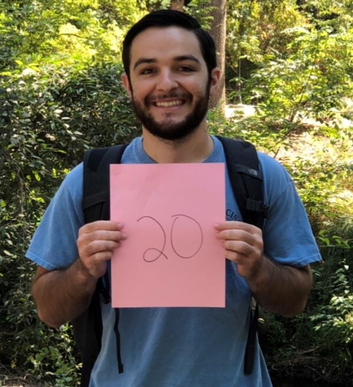

 

# Peer Mentors for Spring 19

Unless specified otherwise, scheduled office hours for Peer Mentors are held in the Math tutoring lab, 4th floor of Miriam Library. They also are part of our Slack workspace. 

You can request help outside their regular office hours _at their discretion_ by asking in the #tutor-request channel in Slack. 
 

----

### Aspen Fairley
<table>
<tr>
  <td width="250"></td>
  <td width="50"></td>
  <td width="250"><strong>Known for:</strong> Being a human Google   
    <strong>Attending: </strong> MW 10-11am   
    <strong>OH: </strong> By appointment (post in #tutor-request Slack channel)   
    <strong>Contact: </strong> afairley@mail.csuchico.edu   </td>
  <td width="50"></td>
  <td width="350">I am a bio major on the EEO course that just transferred in last fall. Grew up in small-town Bishop, CA (props to anyone who knows it) and graduated from College of the Sequoias in Visalia, CA. In my spare time, I love to read, travel, and watch youtube science channels</td>
</tr>
</table>

 

----

### Kyle Colombi
<table>
<tr>
  <td width="250"></td>
  <td width="50"></td>
  <td width="250"><strong>Known for: </strong> Knowing and sharing useless historical facts   
    <strong>Attending: </strong> MF 10-11am   
    <strong>OH: </strong> T 12-1pm   
    <strong>Contact: </strong> kcolombi@mail.csuchico.edu   </td>
  <td width="50"></td>
  <td width="350"> I'm from Fort Bragg, CA and I'm a cell/molec biology major. Outside of school, I spend my time reading, playing games, or fishing.</td>
</tr>
</table>

 

----

### Nicole Paulson
<table>
<tr>
  <td width="250"></td>
  <td width="50"></td>
  <td width="250"><strong>Known for: working on quantitative and environmental economic projects </strong>   
    <strong>Attending: </strong> F 12-1pm   
    <strong>OH: </strong> TR 2-3pm at Community Coding   
    <strong>Contact: </strong> npaulson1@mail.csuchico.edu   </td>
  <td width="50"></td>
  <td width="350"> I love cooking, swimming and hiking at Bidwell, reading, and traveling with friends. I have worked at the Center for Economic Development, as an ambassador for the College of Behavioral and Social Sciences, and am planning to get my master's in public policy. </td>
</tr>
</table>

 

